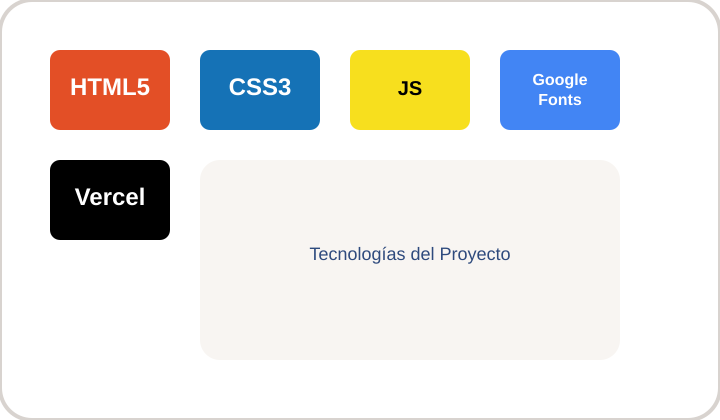
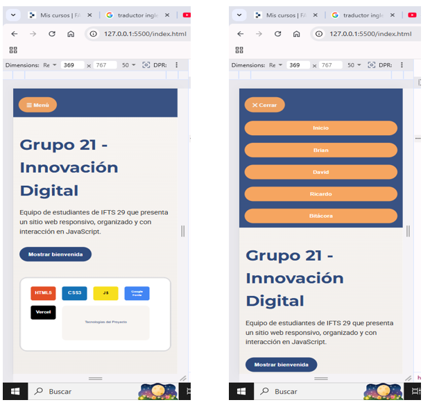

# TP1 - Grupo 21: Innovación Digital

**URL Deploy:** https://portafolio-personal-9l9i.vercel.app/

## Descripción
Proyecto del Trabajo Práctico 1 de IFTS 29. Este sitio web presenta a un equipo de tres estudiantes con páginas individuales, navegación interna, diseño adaptable y funciones interactivas con JavaScript.

## Integrantes
- Brian Gonzalo García - [GitHub](https://github.com/enobrian-maker/PFO1-Frontend)
- David Fernando Pérez - [GitHub](https://github.com/davidfg00077/DW-TP1-GRUPAL/tree/RAMA1)
- Ricardo Cesar Canteros - [GitHub](https://github.com/ricardo197578/porfolio_Desarrollo_Front.git)

## Tecnologías Utilizadas
- HTML5
- CSS3
- JavaScript
- Google Fonts (Montserrat, Roboto)
- Vercel para publicación

## Estructura de Archivos
- `index.html` en el directorio raíz como portada principal.
- `brian.html`, `david.html` y `ricardo.html` en el directorio raíz para las páginas individuales.
- `bitacora.html` en el directorio raíz para la bitácora del equipo.
- `css/styles.css` para todos los estilos.
- `js/main.js`, `js/brian.js`, `js/david.js`, `js/ricardo.js` para las interacciones.
- `img/` contiene avatares e imágenes de presentación.

## Guía de Estilos
**Paleta de colores**
- Fondo principal: `#f8f5f2`
- Texto principal: `#2b2b2b`
- Color primario: `#2e4a7d`
- Color secundario/acento: `#f6a560`
- Fondos de tarjetas: `#ffffff`

**Tipografías**
- Títulos: Montserrat (Google Fonts)
- Texto del cuerpo: Roboto (Google Fonts)

**Iconografía y privacidad**
- Se utilizaron avatares e ilustraciones en lugar de fotos personales reales.

## JavaScript
- **Portada (`index.html`):** `js/main.js` — al hacer clic en el botón se muestra un mensaje de bienvenida aleatorio.
- **Brian (`brian.html`):** `js/brian.js` — muestra u oculta un consejo adicional dentro de su tarjeta.
- **David (`david.html`):** `js/david.js` — cambia el estilo de la tarjeta entre dos temas visuales.
- **Ricardo (`ricardo.html`):** `js/ricardo.js` — muestra u oculta un detalle extra de navegación.

## Capturas de Pantalla

## Enlace al Proyecto Desplegado
https://portafolio-personal-9l9i.vercel.app/

## Uso de IA
- **Herramientas:** Gemini Flash 3 / Copilot.
- **Uso en contenido:** Se generaron textos de presentación (Utilizamos los nombres de cada integrante y modificamos los apellidos para que tenga una prueba de coherencia logica con los integrantes del grupo nro. 21), la estructura del README y las descripciones de las secciones.
- **Uso en código:** Se apoyó en la creación de la lógica JavaScript para las interacciones y en la organización de estilos responsivos.
- **Imágenes:** Los avatares se desarrollaron como ilustraciones de privacidad; no se utilizaron fotos personales reales.
